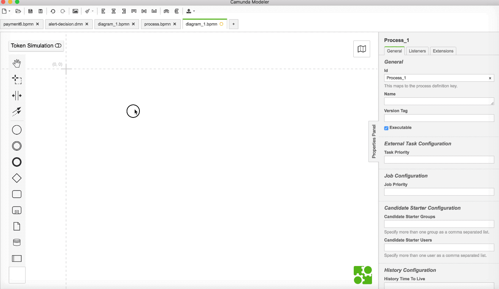

# Camunda Modeler Plugin - UserTask Generated Form Preview and Embedded Form Generator

This plugin adds a 'Preview Form' Button to all BPMN User Tasks in the Camunda Modeler Properties Panel.
Once you click on this button a overlay with show you a preview of your form that has been defined as form fields in the UserTask Forms Tab. It shows you how the form will look like in the default Camunda Tasklist.

Besides just giving you a preview, this plugin automatically generates HTML source code that you will need to create an embedded form for your UserTask.

So this plugin is the perfect fit if you often start with simple generated form fields and then want to make them more advanced by using the embedded forms functionality in the Tasklist.

## Example

## Installation

Put the whole directory including subdirectories into the `plugins` directory of the Camunda Modeler and you're ready to go.

Model a UserTask and check in the Forms Tab if you are seeing the "Preview Form" button.

If you're interested in how to create your own plugins see the [documentation](https://github.com/camunda/camunda-modeler/tree/develop/docs/plugins/README.md) and this [example](https://github.com/camunda/camunda-modeler-plugin-example).
